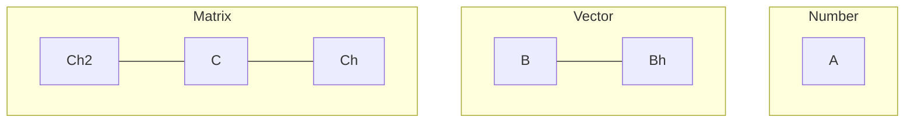
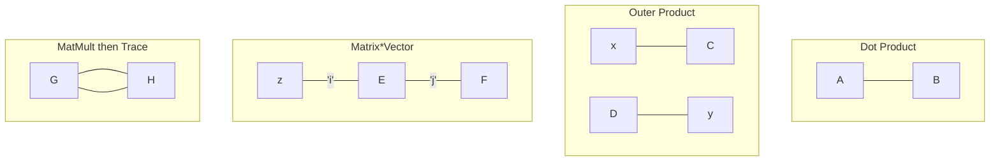
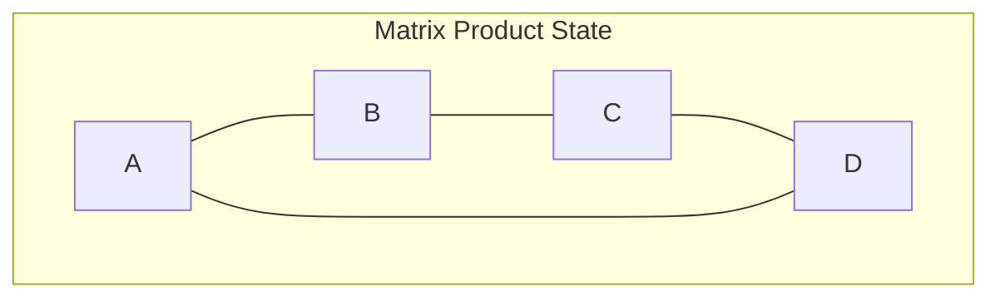

## Tensors
Via penrose notation

### Basic Notation
Each line can be an index, obviously. So each line on the matrix can be $i,j,k$

So for a 3-tensor $A_{ijk}$, we have a cube of numbers where say, $A_{0,2,1}$ is the number in the 0th row, 2nd column, and 1st depth. We can then combine tensors as

Matmult along Trace is a great example where matmult will result in a 2-tensor i.e a node with 2 lines coming out of it, since we contract along one of the indices. Then we will have a node looped to itself which is a 2-tensor connected to itself which is a trace of a matrix.

## Matrix Product State
A matrix product state is a way to represent a quantum state as a tensor network. We can represent a state as a tensor network where each tensor is a matrix. Traditionally written as $|\Psi \rangle =\sum _{\{s\}}\operatorname {Tr} \left[A_{1}^{(s_{1})}A_{2}^{(s_{2})}\cdots A_{N}^{(s_{N})}\right]|s_{1}s_{2}\ldots s_{N}\rangle$

### Examples
#### GHZ State
The GHZ state is a 3-qubit state that is entangled. It is written as $|\text{GHZ}\rangle = \frac{1}{\sqrt{2}}(|0\rangle^{\otimes N} + |1\rangle^{\otimes N})$

Which we can write as

$$
\begin{aligned}
A^{(0)} &= \begin{bmatrix} 1 & 0 \\ 0 & 0 \end{bmatrix}, A^{(1)} &= \begin{bmatrix} 0 & 0 \\ 0 & 1 \end{bmatrix}
\end{aligned}
$$

Then

$$
A \equiv |0\rangle A^{(0)} + |1\rangle A^{(1)} + \cdots + |d-1\rangle A^{(d-1)}
$$

This is a special MPS

$$
AA = \begin{bmatrix} |0000\rangle & 0 \\ 0 & |1111\rangle \end{bmatrix}
$$